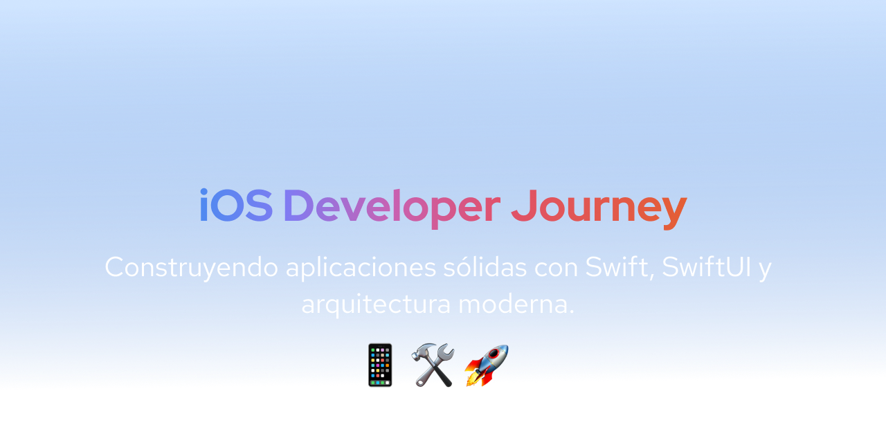

# iOS Developer Portfolio

<!-- Imagen de portada -->

  

Este repositorio reúne proyectos desarrollados para fortalecer y aplicar conocimientos en Swift, SwiftUI, arquitecturas móviles modernas, concurrencia, consumo de servicios RESTful y buenas prácticas de ingeniería de software en aplicaciones iOS.

---

## Stack Técnico

- **Lenguaje:** Swift
- **Frameworks:** SwiftUI, UIKit (solo para integración puntual en MVC)
- **Arquitecturas:** MVC, MVVM, MVVM-C, VIPER, Clean Architecture
- **Gestión de dependencias:** Swift Package Manager
- **Herramientas:** Xcode, Git, GitHub
- **Testing:** XCTest, Desarrollo Guiado por Pruebas (TDD)
- **Otros:** Grand Central Dispatch (GCD) para gestión de concurrencia, consumo de APIs RESTful

---

## Proyectos

| Proyecto | Descripción breve |
|:---|:---|
| [NotesApp](https://github.com/matias-a-m/NotesApp/tree/main) | Aplicación CRUD de notas locales utilizando UIKit y UserDefaults. Estructurada bajo el patrón MVC. |
| [QuotesApp](https://github.com/matias-a-m/QuotesApp/tree/main) | Aplicación que muestra citas motivacionales obtenidas desde la API de ZenQuotes. Desarrollada utilizando SwiftUI y el patrón de arquitectura MVVM, integrando asincronía moderna con Swift Concurrency para la carga remota de datos. |

- TasksFlow | Gestor de tareas locales con navegación modularizada mediante Coordinators. Implementada en SwiftUI bajo arquitectura MVVM-C. |
- ContactsManager | Aplicación de gestión de contactos locales con separación estricta de responsabilidades. Arquitectura VIPER adaptada a SwiftUI. |
- BooksExplorer | Explorador de libros que consume datos de Google Books API. Desarrollado en SwiftUI aplicando principios de Clean Architecture y optimización de concurrencia con GCD. |

---

## Contacto

Para consultas profesionales, colaboración o proyectos:

- Correo electrónico: matias.a.molina87@icloud.com
- [LinkedIn](https://www.linkedin.com/in/matias-adrián-m-3475a471/)

---

